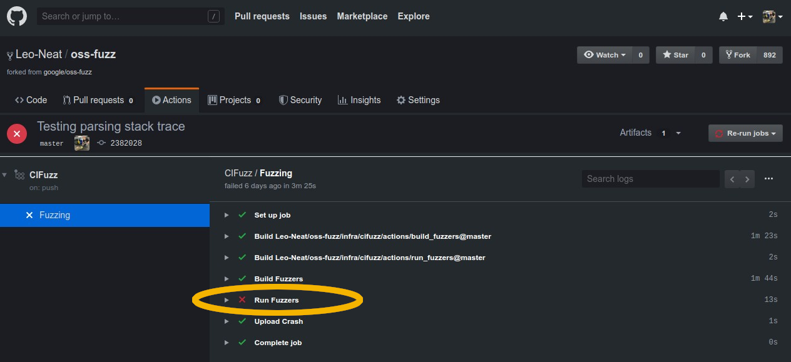
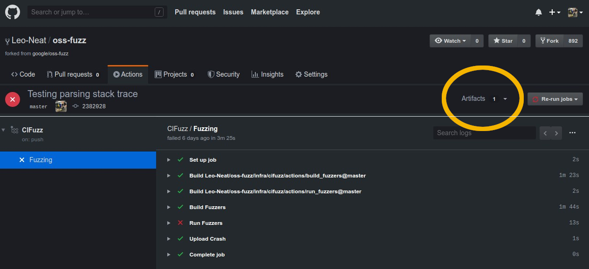

# Continuous Integration

OSS-Fuzz offers **CIFuzz**, which will run your fuzz targets each time a pull request
is submitted, for projects hosted on GitHub. This allows you to detect and
fix bugs before they make it into your codebase

## How it works

CIFuzz works by checking out a repository at the head of a pull request. The
project's fuzz targets are built and run for
a definite amount of time (default is 10 minutes). If a bug is found, the
stack trace as well as the test case are made abailable for download.
 If a crash is not found the test passes with a green check.

## Requirements

1. Your project must be integrated in OSS-Fuzz.
1. Your project is hosted on GitHub.

## Integrating into your repository

You can integrate CIFuzz into your project using the following steps:
1. Create a `.github` directory in the root of your project.
1. Create a `workflows` directory inside of your `.github` directory.
1. Copy the example [`main.yml`](https://github.com/google/oss-fuzz/blob/master/infra/cifuzz/example_main.yml)
file over from the OSS-Fuzz repository to the `workflows` directory.
1. Change the `oss-fuzz-project-name` value in `main.yml` from `example` to the name of your OSS-Fuzz project. It is **very important** that you use your OSS-Fuzz project name which is case sensitive. This name
is the name of your project's subdirectory in the [`projects`](https://github.com/google/oss-fuzz/tree/master/projects) directory of OSS-Fuzz.

Your directory structure should look like the following:
```
project
|___ .github
|    |____ workflows
|          |____ main.yml
|___ other-files
```

main.yml for an example project:

```yaml
name: CIFuzz
on: [pull_request]
jobs:
 Fuzzing:
   runs-on: ubuntu-latest
   steps:
   - name: Build Fuzzers
     uses: google/oss-fuzz/infra/cifuzz/actions/build_fuzzers@master
     with:
       oss-fuzz-project-name: 'example'
       dry-run: false
   - name: Run Fuzzers
     uses: google/oss-fuzz/infra/cifuzz/actions/run_fuzzers@master
     with:
       oss-fuzz-project-name: 'example'
       fuzz-seconds: 600
       dry-run: false
   - name: Upload Crash
     uses: actions/upload-artifact@v1
     if: failure()
     with:
       name: artifacts
       path: ./out/artifacts
```


### Optional configuration

#### Configurable Variables
`fuzz-time`: Determines how long CIFuzz spends fuzzing your project in seconds.
The default is 600 seconds. The GitHub Actions max run time is 21600 seconds (6 hours).

`dry-run`: Determines if CIFuzz surfaces errors. The default value is `false`. When set to `true`,
CIFuzz will never report a failure even if it finds a crash in your project.
This requires the user to manually check the logs for detected bugs. If dry run mode is desired,
make sure to set the dry-run parameters in both the `Build Fuzzers` and `Run Fuzzers` action step.

#### Adding Other Sanitizers
CIFuzz supports address, memory and undefined sanitizers. Address is the default
sanitizer and will be used for every job in which a sanitizer is not specified.
To add another sanitizer to your workflow copy the `Fuzzing` job and rename it
to the sanitizer you want to fuzz with. Then add the sanitizer variable to both
the `Build Fuzzers` step and the `Run Fuzzers` step. The choices are `'address'`,
`'memory'`, and `'undefined'`. Once this additional job is configured the CIFuzz
workflow will run all of the jobs corresponding to each sanitizer simultaneously.
It is important to note that the `Build Fuzzers` and the `Run Fuzzers` sanitizer
field needs to be the same. See the following main.yml file for an example.

```yaml
name: CIFuzz
on: [pull_request]
jobs:
 AddressFuzzing:
   runs-on: ubuntu-latest
   steps:
   - name: Build Fuzzers
     uses: google/oss-fuzz/infra/cifuzz/actions/build_fuzzers@master
     with:
       oss-fuzz-project-name: 'example'
       dry-run: false
       # sanitizer: address
   - name: Run Fuzzers
     uses: google/oss-fuzz/infra/cifuzz/actions/run_fuzzers@master
     with:
       oss-fuzz-project-name: 'example'
       fuzz-seconds: 600
       dry-run: false
       # sanitizer: address
   - name: Upload Crash
     uses: actions/upload-artifact@v1
     if: failure()
     with:
       name: Address-Artifacts
       path: ./out/artifacts
 UndefinedFuzzing:
   runs-on: ubuntu-latest
   steps:
   - name: Build Fuzzers
     uses: google/oss-fuzz/infra/cifuzz/actions/build_fuzzers@master
     with:
       oss-fuzz-project-name: 'example'
       dry-run: false
       sanitizer: 'undefined'
   - name: Run Fuzzers
     uses: google/oss-fuzz/infra/cifuzz/actions/run_fuzzers@master
     with:
       oss-fuzz-project-name: 'example'
       fuzz-seconds: 600
       dry-run: false
       sanitizer: 'undefined'
   - name: Upload Crash
     uses: actions/upload-artifact@v1
     if: failure()
     with:
       name: Undefined-Artifacts
       path: ./out/artifacts
```

## Understanding results

The results of CIFuzz can be found in two different places.

* Run fuzzers log:
    1. This log can be accessed in the `actions` tab of a CIFuzz integrated repo.
    1. Click on the `CIFuzz` button in the workflow selector on the left hand side.
    1. Click on the event triggered by your desired pull request.
    1. Click the `Fuzzing` workflow.
    1. Select the `Run Fuzzer` drop down. It should show the timestamps and results
    from each of the fuzz targets.




*  Artifacts:
    1. When a crash is found by CIFuzz the Upload Artifact event is triggered.
    1. This will cause a pop up in the right hand corner, allowing
    you to download a zip file called `artifacts`.
    1. `artifacts` contains two files:
        * `test_case` - a test case that can be used to reproduce the crash.
        * `bug_summary` - the stack trace and summary of the crash.




## Feedback/Questions/Issues

Create an issue in [OSS-Fuzz](https://github.com/google/oss-fuzz/issues/new) if you have questions of any other feedback on CIFuzz.
